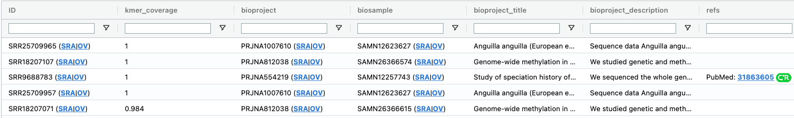
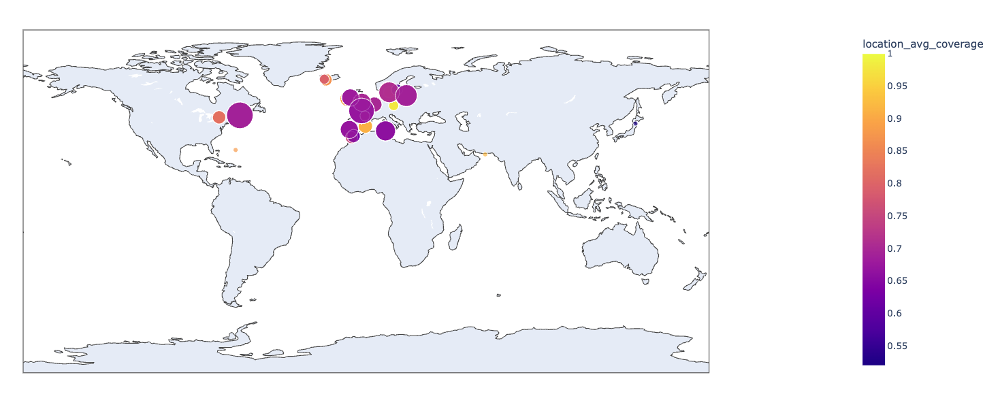
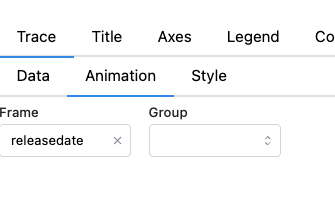
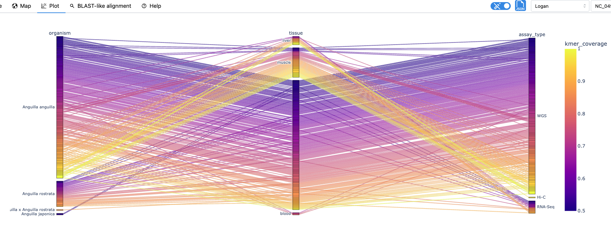
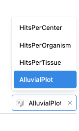
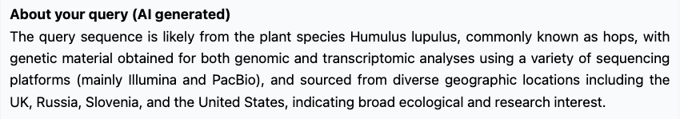
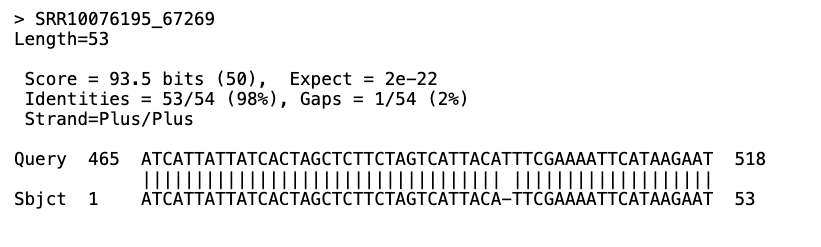

# Part B — Using **Logan Search** to Locate Sequences Across the SRA

> "Query the planet in minutes."

Logan Search lets you search up to **1 kb** of DNA/RNA and instantly identifies every public *Sequence Read Archive* (SRA) dataset that is likely to contain it. It does so by finding shared k-mers between the query sequence and each SRA accession. It's built on a petabyte-scale Bloom filter index covering >27 million runs assembled by **Logan**.

---

## 0 . Prerequisites

| Tool | Why you need it | Install |
|------|-----------------|---------|
| Web browser & email | Submit queries + receive result links | Any modern browser |
| *Optional* `aws` CLI | Fetch assemblies for the hits | See Part A or `aws help` |
| *Optional* `parallel`, `seqkit` | Batch downloads & sequence fiddling | `GitHub`, `brew`, `apt`, etc. |

---


## 1 . Prepare a Query Sequence

* **Limit:** ≤ 1 000 bp (service cap)  
* **Formats:** FASTA
* **Tip:** pick a region *specific* to your organism/gene—avoid conserved rRNA or adapters.

```bash
# Example: extract 800 bp from the E.coli assembly from PartA
seqkit subseq -r 1001:1800 SRR2584403.contigs.fa --quiet | seqkit seq -m 800 -w 0  | head -n 2 > query.fa
```

What does the command above really do?

<details><summary>Answer:</summary>
<p>

- `seqkit subseq -r` concerves only positions from 1001 to 1800 of each sequence
- `seqkit seq -m 800 -w 0` only print sequences longer than or equal to 800 and shows them on one line per sequence
- `head -n 2 > query.fa` conserves only the two first lines (so the first header+sequence) and put them in a file name `query.fa`

</p>
</details>

But actually, let us not query that particular sequence, because E. coli is everywhere, there will be too many hits and Logan Search takes more time.

Let us instead query this mysterious sequence:

```
TGGAAAAAGAGGCAACAGCTTTGCGAGCATCTACTTTTTATTCTCCCTTATCTGCTTGACTGCTATTTAACTCTTCACCATGGTCGAGAAATTTGTTGGCACCTGGAAGATCGCAGACAGCCATAATTTTGGTGAATACCTGAAAGCTATCGGTGAGTTAAATGAATATTTAAACATGTGTACACTTTGTACACCTATTTCTTAAGAAGGATCTGCTCTATTCCATGTAGCGGGACAAAAACATATAACGTGGTCACAAACTAATCCTTTTTGCTTTTCACTCATTTAAAAACATACACATATTACAGTAAATACTTGTCACCCACAAGCAAGATGCATGCCTTTGCTATGATTATAGACCACCAGTATAGTCCAAGGACATTCCTGTCAGGTACAGTTCAAACAGAGGTAGAGGAACTGAAAGGTTACAACTAGCCCTGTATTTGAGGTCAAGTTGTAACAGCTCCAGGGCACATAGTAACAGCATCTGAGAATGGCAGGCTGGAAAGAACTATGTTTCCACACCACACCAAGTCAAAGGTAGGTGATCTAAAATGTTTTTACAGTTAACATTTGTCATCTTTGATATTTGTCATGTAGAAAATGGCTCATAATTTTTCTAACTAACCGCTCTTCACACCAACAGATTAGTATGAGGTGAATGCCTCCAAAAGCATGTATAAGAGTGAGTGTTCCCCAAGGAAACTATTTTATGCGCGTGCGCAATAGAGTGTTAGCCACTGGCACTCTGCATCTCTCCCATATCCCTGAGCCAATTAAGCAACCTCACACACACAAGTAGGATTCCATCTGACCTGTTCGCTCATGCGCCGCCTTTACCGAGCATTCTGGGTAATGACGCTTCTTGTTGAACATTTCAAATCATCCCGCCACTGACGCGTGAGAAGCATGACCCGCGTTAGTCCGTGCCCTGGTCTCCCCTTCTCAAGCAGAGAAGCCGGTGACTGGCTGGTGAGTCCTTCTGCCCAGTCTCGAAAGG
```


---

## 2 . Open the Interface

1. Navigate to **<https://logan-search.org>**.  
2. Click **“Query the planet”** (upper‑right).  
3. Under **Input**, choose **Text** (paste) *or* **File** (upload) and provide your sequence.  
4. *(Optional)* adjust the sidebar settings (see table below).  
5. Hit **Submit**. Wait about 5 minutes.

**Pro tip**: search `All no viral` instead of `all` groups for faster search. (Because search scales with number of SRA runs, and there are a lot of Covid19 runs.)

### Sidebar settings

| Setting | What it does |
|---------|--------------|
| **Groups** | Search a subset of SRA (*Genomic*, *Single‑cell*, etc). By default, use *all* |
| **Minimum coverage** | Fraction of 31‑mers that must match (default = 0.5). Raising it reduces sensitivity but increases specificity. |
| **Email** | Necessary, and results links are sent there. Note: emails are not stored.|

> **Service limits**  
> • One sequence per submission  
> • Top 20 000 hits returned  
> • Ten queries per day max  
> • Results retained for **1 month**—download them!

---

## 3 . Look At The Results

Once Logan Search has finished searching (takes about 5 minutes), browse through the results webpage, and take a look at the map and plots!

The first tab, "Table", show the list of SRA accessions where the query sequence is present. 



Key columns are:

* `ID`: SRA accession 
* `kmer_coverage`: ratio of the number of k-mers of the query are also present in the accession
* `Refs`: provides the access to associated publication when public
* `bto_id`: link to **OnToBee** ontology server
* unitigs and contigs stats (nb sequences, cumulated size)
* `location_*`: stats about experiments that fall in the same geographical location
* All the other columns are from the [SRA metadata](https://www.ncbi.nlm.nih.gov/sra/docs/sra-cloud-based-metadata-table/)


The next tab, "Map", shows the location of SRA samples according to ther geolocalization metadata provided by the data submitters.




The color of the circles correspond to `kmer_coverage`, and the size of the circle is proportional to the number of SRA samples at that location.


**Q1.** Animate the map with respect to the release date.


<details><summary>Answer:</summary>
<p>



</p>
</details>

The next tab, "Plots", shows various (~infinite possibilities) plots for the metadata!




The bottom-right button proposes some examples, but feel free to explore the offered possibilities. 



To see many other plot templates, i.e. for sequencing centers, tissues.

**Q2.** What do you think is the organism?

<details><summary>Answer:</summary>
<p>

Hops. Check the IA generated sumary: 




</p>
</details>
**Q3.** Where is it mostly found?

<details><summary>Answer:</summary>
<p>

In the US

</p>
</details>

**Q4.** Is the sequence specific to that organism?

<details><summary>Answer:</summary>
<p>

Nope we also have some canabis.

</p>
</details>

**Q5** How to filter accessions, including for visualisation (map and plots) purpose?

<details><summary>Answer:</summary>
<p>

Filtering the *Table* using any criterion, also filters concidered accessions for plots, map, and BLAST-like alignement (see next Section)


</p>
</details>

## 4. Get a BLAST-like alignment

Logan Search main results table does not return alignments, instead, it just returns "similarity" of your query sequence with each accession. Think of it as "how likely is the sequence present in that accession", or, "how similar is the query sequence to the sequence present in the accession", although both statements are not strictly true.

You may verify that the sequence is indeed present by manually asking Logan Search. Or you may want to go to the alignement level for instance checking for specific SNPs.
To do this, click on the "BLAST-like alignment" tab:


**Q5.** How to compute an alignement with **contigs** of an accession sharing exactly 90% of the kmers with the query?


<details><summary>Answer:</summary>
<p>

Filter the table, normaly, only accession SRR10076195 remains
</p>
</details>


**Q5.** How many search results?


<details><summary>Answer:</summary>
<p>

1

</p>
</details>

**Q6.** Is the query sequence fully contained in the contig?


<details><summary>Answer:</summary>
<p>

Nope

</p>
</details>

**Q7.** Is the query sequence exactly present in the **unitigs**, or are there mismatches?


<details><summary>Answer:</summary>
<p>

There are mismatches



</p>
</details>

**Q8** In case there are some mismatches, how is it possible for accessions having 100% similarity with the query?


<details><summary>Answer:</summary>
<p>

- Because similarity is based on kmers only (not checking their contiguity nor order)
- We alignments are made on contigs: the similarity is computed on unitigs. In the contigs, the sensitivity is lower due to choices during th assembly process.

</p>
</details>

## 5 . Retrieve Your Results

The confirmation e‑mail contains also a link for downloading the results. Let us try this feature.

Get the .zip provided by the `https://logan-search.org/api/download/<session>` link in the email. Then:
```bash
# Unzip & extract the accession column
unzip kmviz-<session>.zip
```
You may extract only the accessions and similarity score: 
```bash
cut -f1,2 <queryname>.tsv | tail -n +2 > hits_sim.acc   # skip header
```

Use a local version of kmviz for exploiting your results: 
```bash
pip install kmviz
python -m kmviz app start session --no-seq-tab
```
Then use a kmviz instance is now running at `http://localhost:8050/dashboard` 

---

## 6 . Download Assemblies for the Hits

```bash
cut -f1 <queryname>.tsv | tail -n +2 > hits.acc 
# Fetch the top 25 hits using 4 parallel threads
head -n 25 hits.acc | parallel -j4 '
  aws s3 cp s3://logan-pub/c/{}/{}.contigs.fa.zst . --no-sign-request &&
  zstd -d {}.contigs.fa.zst
'
```

You now have contigs ready for alignment, variant calling, or pangenome analysis.

---


## 7 . Troubleshooting

| Symptom | Likely cause | Fix |
|---------|--------------|-----|
| "Too many concurrent queries" | High server load | Wait a few minutes, then resubmit. |
| Empty result set | Sequence too short or repetitive | Lengthen the query or choose a unique region. |
| No e‑mail received | Spam filter or typo | Check spam; resubmit with correct address. |
| "Top 20 k cutoff" notice | Query matched *too many* datasets | Raise **Minimum coverage** or pick a more specific sequence. |

---

## 8 . Next Steps

* **Variant scanning:** align all retrieved contigs to a reference.  
* **Phylogenetics:** build a tree from sequences extracted from the matched runs. 
* **Epidemiology:** combine `.tsv` Logan Search results with sampling dates/locations.  
* **Iterative discovery:** pull novel haplotypes → search again → expand the network.

---

### 🏁 Quick Recap

1. Craft ≤ 1 kb sequence.  
2. Submit on Logan Search, tweak filters, add your e‑mail.  
3. Explore *kmviz*, download the ZIP.  
4. Script‑fetch assemblies, and dive into analysis.

You’ve just queried **every** public sequencing run on Earth in minutes—welcome to planetary‑scale genomics!


Now, let's move on to [Part C](PartC.md).
